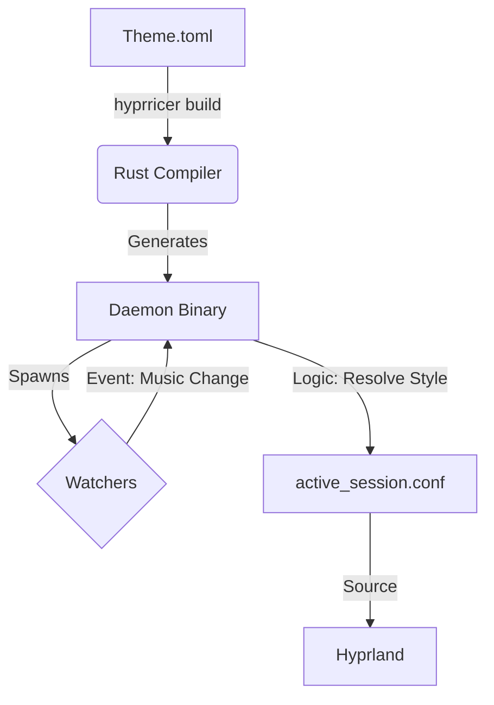

# hyprricer 🍚

> **The Reactive Theme Engine for Hyprland.**
> *Compile your rice into a high-performance, event-driven daemon.*

  

---

## ⚡ What is this?

**hyprricer** is not a traditional dotfile manager. It does not just copy config files.

It is a **Transpiler** that reads your theme definition and compiles it into a specialized **Rust Binary (Daemon)**. This daemon runs in the background, listening to system events (Music, Battery, Time, Weather) and updating your Hyprland configuration **instantly**.

### Why?
* **Zero Latency:** Logic is compiled to native code. No shell script overhead.
* **Reactive:** Change window borders when the music genre changes. Dim the bar when the battery is low.
* **Type-Safe:** If your theme logic is broken, it won't even compile. No more broken configs at runtime.

---

## 🚀 Quick Start

### 1. Install
```bash
git clone [https://github.com/YourRepo/hyprricer.git](https://github.com/YourRepo/hyprricer.git) ~/.config/hypr/hyprricer
cd ~/.config/hypr/hyprricer
cargo build --release
```

### 2. Configure Hyprland
Add this to the top of your `~/.config/hypr/hyprland.conf`:
```ini
source = ~/.config/hypr/hyprricer/live/active_session.conf
```

### 3. Build a Theme
```bash
# Build and start the 'default' profile
./target/release/hyprricer build --profile default
```

---

## 📚 Documentation

We have detailed guides for every type of user:

| I want to... | Read this |
| :--- | :--- |
| **Install & Use It** | [📖 Installation Guide](docs/installation.md) |
| **Create a Theme** | [🎨 Theme Developer Guide](docs/guide_for_ricers.md) |
| **Add New Watchers** | [wv Registry Manual](docs/registry_manual.md) |
| **Understand the Code** | [🏗 System Architecture](docs/architecture.md) |

---

## 🏗 Architecture

`hyprricer` separates the **Definition** (TOML) from the **Runtime** (Binary).



### Directory Structure
* **`live/`**: Contains the running daemon and the active config file.
* **`catalog/`**: The registry of all available components (Watchers, Styles).
* **`themes/`**: Your theme packages (Logic + Templates).
* **`generated/`**: The intermediate Rust source code (useful for debugging).

---

## 🤝 Contributing

We welcome Pull Requests!
* **New Features:** Please discuss in an Issue first.
* **New Registry Items:** Feel free to submit PRs adding new Watchers (e.g., specific hardware sensors) to `catalog/registry/`.

---

*Made with ❤️ and Rust for the Hyprland Community.*
*Architected and generated with the help of the Gemini model.*
